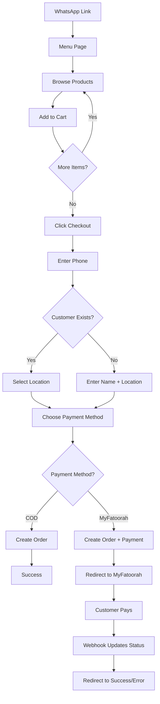

# Food Ordering System - Quick Reference

## 🎯 System Overview

One-page food ordering system with:

- ✅ No authentication (phone-based)
- ✅ WhatsApp integration ready
- ✅ MyFatoorah payment gateway
- ✅ Payload CMS backend
- ✅ React Query + Server Actions

---

## 📊 Database Schema

### Collections

```
Products
├── title (localized)
├── description (localized)
├── price (number)
├── image (media)
└── active (boolean)

Customers
├── name
├── phone (unique, indexed)
├── phone2
└── locations (relationship → Locations[])

Locations
├── customer (relationship → Customers)
├── description
├── lat (number)
└── lng (number)

Orders
├── customer (relationship → Customers)
├── phone (denormalized)
├── phone2
├── location (relationship → Locations)
├── items[] (array)
│   ├── product (relationship → Products)
│   ├── qty
│   ├── unitPrice
│   └── lineTotal
├── subtotal (calculated)
├── deliveryFee
├── total (calculated)
├── paymentMethod (cod | myfatoorah)
├── paymentStatus (pending | paid | failed)
└── orderStatus (created | preparing | dispatched | delivered)

PaymentRecords
├── order (relationship → Orders)
├── gateway (myfatoorah)
├── invoiceId
├── status (pending | success | failed | cancelled)
├── amount
└── payload (json)
```

### Globals

```
StoreSettings
├── restaurantName (localized)
├── currency
├── deliveryFee
├── myFatoorahApiKey
├── myFatoorahTestMode
├── myFatoorahCallbackUrl
├── myFatoorahErrorUrl
└── whatsappTemplate
```

---

## 🔄 Complete Flow



---

## 🛠️ API Endpoints

### Server Actions

```typescript
// Products
getProducts(locale: 'ar' | 'en')
getProductById(id: string, locale: 'ar' | 'en')

// Customers
getCustomerByPhone(phone: string)
createCustomer({ name, phone, phone2? })

// Locations
createLocation({ customer, description, lat, lng })
getCustomerLocations(customerId: string)

// Settings
getStoreSettings(locale: 'ar' | 'en')

// Checkout
checkout({
  phone,
  phone2?,
  name?,
  location: { id? | description, lat, lng },
  items: [{ productId, qty }],
  paymentMethod: 'cod' | 'myfatoorah'
})
```

### REST API

```
POST /api/payment/initiate
Body: { orderId, amount, customerName, customerPhone }
Response: { success, paymentUrl, invoiceId }

POST /api/payment/webhook
Headers: X-MyFatoorah-Signature
Body: MyFatoorah webhook payload
Response: { success }
```

---

## 🎨 Frontend Components

### Component Tree

```
App
└── Providers (QueryClient + Cart)
    └── Page
        ├── ProductsList
        │   └── ProductCard[]
        └── FloatingCart
            ├── CartItem[]
            └── CheckoutDialog
                ├── LocationInput
                └── PaymentMethodSelector
```

### Key Hooks

```typescript
// Cart Management
const { items, addItem, removeItem, updateQty, clearCart, subtotal, itemCount } = useCart()

// Products Query
const { data, isLoading, error } = useProducts()

// Checkout Mutation
const checkoutMutation = useCheckout()
checkoutMutation.mutate(checkoutData)

// Debounce
const debouncedValue = useDebounce(value, 500)
```

---

## ⚙️ Configuration

### Environment Variables

```bash
DATABASE_URI=mongodb://...
PAYLOAD_SECRET=...
NEXT_PUBLIC_URL=https://yourdomain.com
```

### Store Settings (Admin Panel)

```
Restaurant Name: Your Restaurant (AR/EN)
Currency: KWD
Delivery Fee: 1.500
MyFatoorah API Key: rLtt6JWv...
Test Mode: ✓ (for testing)
Callback URL: https://yourdomain.com/payment/success
Error URL: https://yourdomain.com/payment/error
```

---

## 🚀 Quick Start

### 1. Start Development

```bash
npm run dev
```

### 2. Access Admin

```
http://localhost:3000/admin
```

### 3. Configure Store Settings

Navigate to: **Globals → Store Settings**

### 4. Add Products

Navigate to: **Collections → Products → Create New**

### 5. Test Frontend

```
http://localhost:3000
```

---

## 📝 Checkout Flow Logic

```typescript
// 1. Check if customer exists
const customer = await getCustomerByPhone(phone)

// 2. Create customer if new
if (!customer) {
  customer = await createCustomer({ name, phone, phone2 })
}

// 3. Create location if provided
if (newLocation) {
  location = await createLocation({
    customer: customer.id,
    ...newLocation
  })
}

// 4. Validate products and get prices
const items = await Promise.all(
  cartItems.map(async (item) => {
    const product = await getProduct(item.productId)
    return {
      product: product.id,
      qty: item.qty,
      unitPrice: product.price,
      lineTotal: product.price * item.qty
    }
  })
)

// 5. Calculate totals
const subtotal = sum(items.map(i => i.lineTotal))
const total = subtotal + deliveryFee

// 6. Create order
const order = await createOrder({
  customer,
  location,
  items,
  subtotal,
  deliveryFee,
  total,
  paymentMethod
})

// 7. If MyFatoorah, initiate payment
if (paymentMethod === 'myfatoorah') {
  const payment = await myFatoorah.initiatePayment({
    amount: total,
    orderReference: order.id,
    ...
  })

  return { paymentUrl: payment.paymentUrl }
}

// 8. Return success for COD
return { success: true, orderId: order.id }
```

---

## 🔐 Access Control

```typescript
// Products
read: public ✓
create/update/delete: admin only

// Customers
read: public ✓
create: public ✓ (for checkout)
update/delete: admin only

// Locations
read: public ✓
create: public ✓ (for checkout)
update/delete: admin only

// Orders
read: admin only
create: public ✓ (for checkout)
update/delete: admin only

// PaymentRecords
read/create/update/delete: admin only

// StoreSettings
read: public ✓ (sensitive fields excluded)
update: admin only
```

---

## 🎯 Key Features

✅ **Phone-Based Identification** - No passwords, no signup
✅ **Automatic Customer Creation** - Seamless first-time experience
✅ **Location Persistence** - Save multiple delivery addresses
✅ **Cart Persistence** - localStorage keeps cart across sessions
✅ **Real-time Validation** - Server-side price validation
✅ **Dual Payment Methods** - COD and online payment
✅ **Webhook Integration** - Automatic status updates
✅ **Localization Ready** - Full AR/EN support
✅ **Type Safety** - End-to-end TypeScript
✅ **Mobile First** - Responsive design

---

## 📦 Dependencies

```json
{
  "payload": "^3.54.0",
  "@payloadcms/db-mongodb": "^3.54.0",
  "@tanstack/react-query": "^5.90.10",
  "next": "15.4.7",
  "react": "19.1.0",
  "next-intl": "^4.5.3",
  "zod": "^4.1.12",
  "sonner": "^2.0.7"
}
```

---

## 🐛 Troubleshooting

### Products not showing?

- Check products are marked as "Active"
- Verify locale is set correctly
- Check browser console for errors

### Customer not recognized?

- Phone number must be at least 8 digits
- Check for typos in phone number
- Wait for debounce (500ms)

### Payment not working?

- Verify MyFatoorah API key is correct
- Check test mode is enabled for testing
- Ensure callback URLs are correct
- Check webhook is configured

### Cart not persisting?

- Check localStorage is enabled
- Clear browser cache if issues persist
- Check browser console for errors

---

## 📞 Support

For issues or questions:

1. Check the [walkthrough.md](file:///C:/Users/raya/.gemini/antigravity/brain/e62de1e0-7787-49f3-8096-7ca299a1c7d2/walkthrough.md)
2. Review the [implementation_plan.md](file:///C:/Users/raya/.gemini/antigravity/brain/e62de1e0-7787-49f3-8096-7ca299a1c7d2/implementation_plan.md)
3. Check Payload documentation: https://payloadcms.com/docs
4. Check MyFatoorah documentation: https://myfatoorah.readme.io/

---

**System Status**: ✅ Fully Implemented and Ready for Testing
